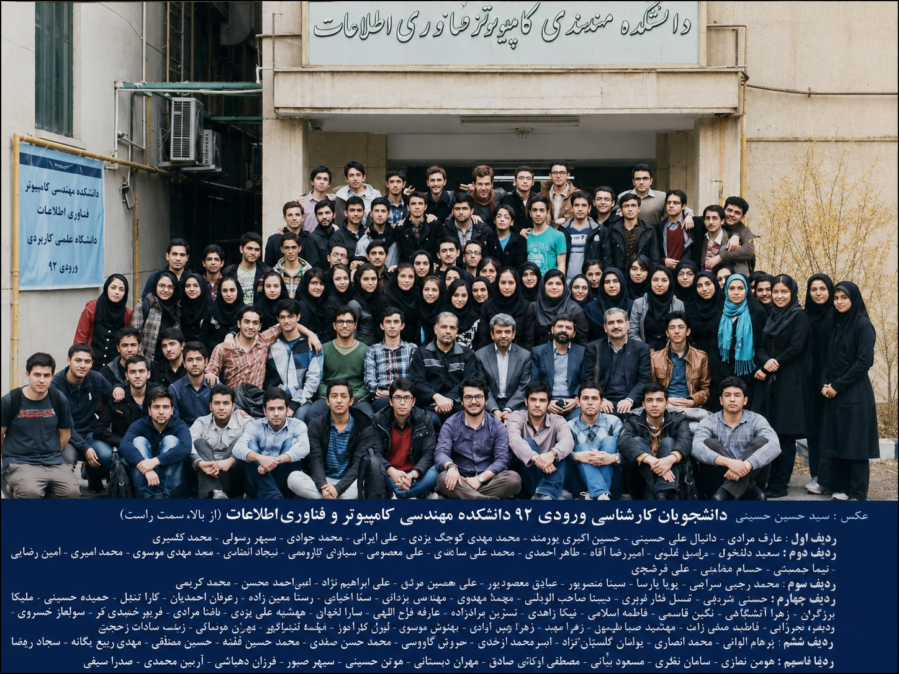

    

# من در امیرکبیر

من پرهام الوانی، سال ۹۲ با شماره دانشجویی ۹۲۳۱۰۵۸ وارد دانشگاه امیرکبیر شدم.
از آن سال تا به امروز در این دانشگاه هستم. این تقریبا همه پروژه‌های من در تمام درس‌هایی است که در این دانشگاه پشت‌سر گذاشتم.
در تمام این سال‌ها واقعا به اساتید و دانشجویان دانشگاه افتخار کردم و می‌کنم.
با وجود تمام کاستی‌های کشورمان و فشارهای ناجوان‌مردانه ناشی از تحریم‌ها خیلی از اساتید و دانشجویان برای بهبود دانشگاه‌ها و درس‌های آن تلاش کردند.
خیلی از هم‌دوره‌ای‌ها و اساتید ما در این سال‌ها مهاجرت کردند؛ رفتن هر یک غمی بزرگ بر شانه‌های من است.
به جرات این سال‌ها از بهترین سال‌های زندگی من بود و امیدوارم همه دانشجویان هم این لحظات را در این دانشکده و دانشگاه تجربه کنند.

امیدوارم این پروژه‌ها و تمرین‌ها برای بقیه کاربردی باشند.

- مبانی کامپیوتر و برنامه‌نویسی دکتر بخشی پاییز ۹۲ - [مخزن](https://github.com/9231058/CE101-C) [مخزن](https://github.com/9231058/reimagined-palm-tree)
- آزمایشگاه کامپیوتر مهندس آرش عبدی پاییز ۹۲ - [مخزن](https://github.com/9231058/solid-eureka)
- ریاضی عمومی ۱ دکتر خسروی پاییز ۹۲
- ریاضی عمومی ۲ دکتر خسروی بهار ۹۳ - [مخزن](https://github.com/9231058/stunning-octo-meme)
- اخلاق مهندسی دکتر یزدانی بهار ۹۳ - [مخزن](https://github.com/9231058/BART)
- ساختمان‌های گسسته دکتر فلاح بهار ۹۳ - [مخزن](https://github.com/9231058/DS92)
- برنامه‌نویسی پیشرفته دکتر نورحسینی بهار ۹۳ - [مخزن](https://github.com/9231058/SudoApache) [مخزن](https://github.com/9231058/JTextEditor) [مخزن](https://github.com/9231058/JIDM) [مخزن](https://github.com/9231058/JCal) [مخزن](https://github.com/9231058/Bubbles) [مخزن](https://github.com/9231058/BattleshipClient) [مخزن](https://github.com/9231058/Battleship) [مخزن](https://github.com/9231058/AP92) [مخزن](https://github.com/9231058/jumong) [مخزن](https://github.com/9231058/AP101) [مخزن](https://github.com/9231058/automatic-octo-engine) [مخزن](https://github.com/9231058/GolabiNetwork)
- ساختمان داده و الگوریتم دکتر موسوی پاییز ۹۳ - [مخزن](https://github.com/9231058/DS-Homework) [مخزن](https://github.com/9231058/HmanCoder)
- سیستم‌های عامل دکتر پی‌براه پاییز ۹۳ - [مخزن](https://github.com/9231058/OS-Homework)
- زبان ماشین و اسمبلی دکتر زرندی پاییز ۹۳ - [مخزن](https://github.com/9231058/ASM-Homework)
- طراحی الگوریتم دکتر موسوی بهار ۹۴ - [مخزن](https://github.com/9231058/DA-Homework)
- نظریه زبان و ماشین دکتر میبدی بهار ۹۴ - [مخزن](https://github.com/9231058/TFA)
- شبکه‌های کامپیوتری ۱ دکتر صادقیان بهار ۹۴ - [مخزن](https://github.com/9231058/ChFTP)
- معماری کامپیوتر دکتر زرندی بهار ۹۴ - [مخزن](https://github.com/9231058/TCache) [مخزن](https://github.com/9231058/CEITDivider) [مخزن](https://github.com/9231058/Arch-Homework)
- شبکه‌های کامپیوتری پیشرفته دکتر خرسندی پاییز ۹۴ - [مخزن](https://github.com/9231058/SDNBazi) [مخزن](https://github.com/9231058/ShakhSDVPN) [مخزن](https://github.com/9231058/ShakhTraffic)
- پایگاه داده دکتر امیرحائری پاییز ۹۴ - [مخزن](https://github.com/9231058/DB-Homework) [مخزن](https://github.com/9231058/BilliT) [مخزن](https://github.com/9231058/DB-Lab)
- زبان‌های برنامه‌نویسی دکتر فلاح پاییز ۹۴ - [مخزن](https://github.com/9231058/pl-notes)
- ریزپردازنده ۱ دکتر همایون‌پور پاییز ۹۴ - [مخزن](https://github.com/9231058/Homayoun) [مخزن](https://github.com/9231058/MP-Homework) [مخزن](https://github.com/9231058/MP101)
- سیستم‌های عامل دکتر زرندی پاییز ۹۴ - [مخزن](https://github.com/9231058/OS-Homework) [مخزن](https://github.com/9231058/Shakh6)
- شبکه‌های کامپیوتری ۲ دکتر صبائی بهار ۹۵ - [مخزن](https://github.com/9231058/UDPNoise)
- طراحی سیستم‌های دیجیتال برنامه‌پذیر دکتر صاحب‌الزمانی بهار ۹۵ - [مخزن](https://github.com/9231058/FPGA-Homework) [مخزن](https://github.com/9231058/HWScheduler)
- مهندسی اینترنت دکتر بخشی بهار ۹۵ - [مخزن](https://github.com/9231058/GameStation) [مخزن](https://github.com/9231058/BozorgOn) [مخزن](https://github.com/9231058/TMail) [مخزن](https://github.com/9231058/THAP)
- روش پژوهش و ارائه مهندسی دکتر شیری بهار ۹۵ - [مخزن](https://github.com/9231058/SDN-RP)
- کارآموزی مرکز تحقیقات مخابرات زیر نظر مهندس ابراهیمی دفتر اینترنت اشیا تابستان ۹۵ - [مخزن](https://github.com/9231058/ITSummel)
- طراحی کامپایلر دکتر رزازی پاییز ۹۵ - [مخزن](https://github.com/9231058/yepc) [مخزن](https://github.com/9231058/miniature-tribble)
- ریاضیات مهندسی دکتر مزلقانی پاییز ۹۵ - [مخزن](https://github.com/9231058/ImageBazi)
- آزمایشگاه ریزپردازنده مهندس اسفندیاری پاییز ۹۵ - [مخزن](https://github.com/9231058/congenial-telegram)
- مبانی هوش مصنوعی دکتر عبادزاده پاییز ۹۵
- طراحی مدارهای واسط دکتر صدیقی بهار ۹۶ - [مخزن](https://github.com/9231058/Rooman) [مخزن](https://github.com/9231058/ShakhLamp) [مخزن](https://github.com/9231058/cuddly-pancake)
- مدیریت شبکه دکتر بخشی بهار ۹۶ - [مخزن](https://github.com/9231058/NM-Homework)
- بهینه‌سازی دکتر بخشی پاییز ۹۶ - [مخزن](https://github.com/9231058/ON-Homework)
- سیستم‌های توزیعی دکتر پدرام پاییز ۹۶ - [مخزن](https://github.com/9231058/Dsystem-Homework)
- سوئیچ و روتر دکتر صبائی پاییز ۹۶ - [مخزن](https://github.com/9231058/HPSR-Homework)
- ارزیابی و کارآیی دکتر صبائی بهار ۹۷ - [مخزن](https://github.com/9231058/PE-Homework)
- شبکه‌های بیسیم پیشرفته دکتر راستی بهار ۹۷ - [مخزن](https://github.com/9231058/AWN-LPLAN)
- اینترنت اشیا دکتر راستی - [مخزن](https://github.com/9231058/symmetrical-telegram)
- چندرسانه‌ای دکتر دهقان بهار ۹۷
- تجارت الکترونیک دکتر اسکندر یزدی پاییز ۹۷
- امنیت شبکه دکتر نیک صفت بهار ۹۸ - [مخزن](https://github.com/9231058/Wireshark)
- بهینه‌سازی خطی پیشرفته ۱ دکتر میرحسنی پاییز ۹۸ - [مخزن](https://github.com/9231058/ALP-Homework)
- یادگیری ماشین دکتر ناظرفرد پاییز ۹۸ - [مخزن](https://github.com/9231058/ML-Homework)
- بهینه‌سازی تصادفی دکتر میرحسنی بهار ۹۹ - [مخزن](https://github.com/9231058/SP-Homework) [مخزن](https://github.com/9231058/farmer)
- الگوریتم‌های پیشرفته دکتر باقری بهار ۹۹

## متفرقه

چند مخزن دیگر که به درس خاصی مربوط نیستند اما در همین سال‌ها ساخته شدند:

- تدریس‌یاری و مطالب کمکی - [مخزن](https://github.com/9231058/literate-guide) [مخزن](https://github.com/9231058/curly-octo-journey) [مخزن](https://github.com/9231058/solid-octo-robot) [مخزن](https://github.com/9231058/glowing-tribble) [مخزن](https://github.com/9231058/good) [مخزن](https://github.com/9231058/glowing-fortnight)
- حل تمرین‌های سایت‌های برنامه‌نویسی - [مخزن](https://github.com/9231058/Codeforces) [مخزن](https://github.com/9231058/UVa) [مخزن](https://github.com/9231058/SGU) [مخزن](https://github.com/9231058/shiny-potato)
- پروژه‌های جانبی - [مخزن](https://github.com/9231058/P2P-ChatRoom) [مخزن](https://github.com/9231058/AUTPortal) [مخزن](https://github.com/9231058/knapsack) [مخزن](https://github.com/9231058/Registerator) [مخزن](https://github.com/9231058/eyd-mobarak) [مخزن](https://github.com/9231058/asroune) [مخزن](https://github.com/9231058/IMPAR)

